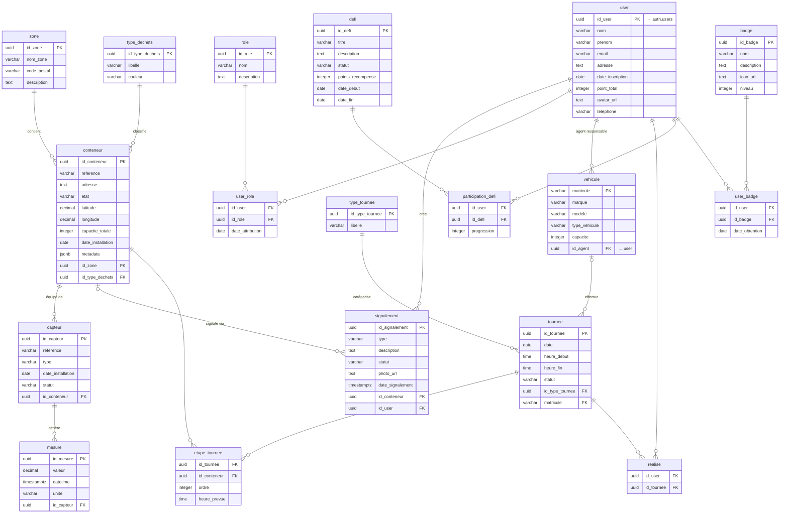

# Diagramme UML — Base de données EcoTrack

> Généré depuis les migrations Supabase (`001` → `008`).  
> Rendu Mermaid : VS Code (extension Markdown Preview Mermaid), GitHub, Notion, draw.io.

---

## Modèle Conceptuel de Données (MCD) — Vue focalisée

> **[ CAPTURE D'ÉCRAN À INSÉRER ICI ]**  
> Schéma entité-association centré sur les trois tables clés du projet :
>
> | Table | Nature | Particularité |
> |---|---|---|
> | `conteneur` | Entité principale | Géolocalisée, métadonnées JSONB, liée à une zone et un type de déchet |
> | `mesure` | Hypertable IoT | Série temporelle horodatée, rattachée à un capteur → conteneur |
> | `signalement` | Entité événementielle | Créée par un utilisateur, optionnellement liée à un conteneur |
>
> **Sources pour générer cette capture :**
> - **Supabase Studio** → *Table Editor* → bouton « Schema Visualizer »
> - **pgAdmin** → clic droit sur la base → *ERD for Database*
> - **DBeaver** → *Database* → *ER Diagram*
>
> ```
> ┌──────────────────────────────────────────────────────┐
> │                                                      │
> │   [ Capture d'écran du MCD à coller ici ]            │
> │   Focus : conteneur · mesure (hypertable) ·          │
> │            signalement                               │
> │                                                      │
> └──────────────────────────────────────────────────────┘
> ```
>
> *Syntaxe pour insérer l'image une fois disponible :*  
> ``

---



---

## Légende des domaines

| Domaine | Tables |
|---|---|
| Géographie | `zone` |
| Déchets & Conteneurs | `type_dechets`, `conteneur` |
| IoT | `capteur`, `mesure` |
| Utilisateurs | `user` (→ auth.users Supabase), `role`, `user_role` |
| Signalements | `signalement` |
| Collecte | `type_tournee`, `vehicule`, `tournee`, `etape_tournee`, `realise` |
| Gamification | `defi`, `badge`, `participation_defi`, `user_badge` |

## Tables de jonction (N:M)

| Table | Entités liées | Attributs propres |
|---|---|---|
| `user_role` | user ↔ role | `date_attribution` |
| `etape_tournee` | tournee ↔ conteneur | `ordre`, `heure_prevue` |
| `realise` | user ↔ tournee | — |
| `participation_defi` | user ↔ defi | `progression` |
| `user_badge` | user ↔ badge | `date_obtention` |

## Clés étrangères notables

| Table | Colonne | Cible | ON DELETE |
|---|---|---|---|
| `conteneur` | `id_zone` | zone | RESTRICT |
| `conteneur` | `id_type_dechets` | type_dechets | RESTRICT |
| `capteur` | `id_conteneur` | conteneur | CASCADE |
| `mesure` | `id_capteur` | capteur | CASCADE |
| `signalement` | `id_conteneur` | conteneur | SET NULL |
| `signalement` | `id_user` | user | CASCADE |
| `vehicule` | `id_agent` | user | SET NULL |
| `tournee` | `matricule` | vehicule | SET NULL |
| `user` | `id_user` | auth.users | CASCADE |
